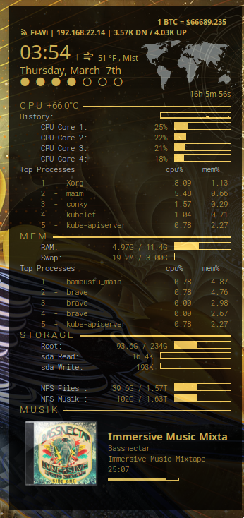

# the-raven-conky-theme
a custom conky theme by nixsalad

My first *published* conky theme

Some things it displays: (from top to bottom)
- bitcoin current price (coinbase api, no key required)
- wifi ssid, ipv4 address, and network speed
- current time, date, and outside temperature (openweatherapi - inspired by closebox73)
- CPU temperature, usage, and list the cpu-heavy processes
- memory usage and list the memory-heavy processes
- storage usage and disk i/o speeds
- music "now playing" with mpd (last.fm api - inspired by https://github.com/floriandejonckheere/conky-mpd)
- transparency with picom 

# Install
Install the theme as ~/.config/conky/the-raven-conky-theme




1. Install conky (thru the package manager ie. apt-get, xbps, etc)
```
# debian
apt-get install conky

# void
xbps-install -y conky
```

2. Launch the conky theme
```
conky -c ~/.config/conky/the-raven-conky-theme/the-raven.conf
```

3. Modify the config to match your system
Some minor modifications will be necessary to accurately reflect your system

`the-raven.conf`:
- change the storage device paths (/dev/sda, /mnt/nfs, etc) 
- change the network device (wlan0, eth0, etc)

`scripts/weather`:
- change the 'cityid' to match your location using openweather api <>
- change the units to either "imperial" or "metric" for temperature in fahrenheit/celsius

